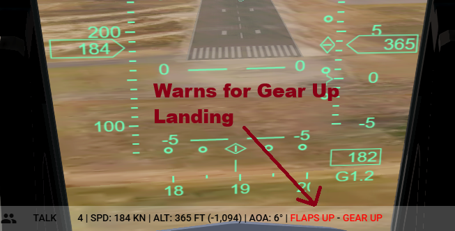
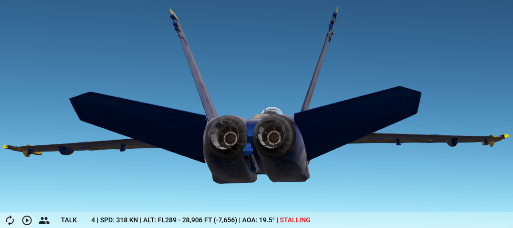
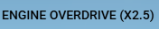

Github page for the GeoFS Blue Angels.

# Blue Angels livery
This allows the GeoFS Blue Angels team to use their Blue Angels livery, and see it in multiplayer, using the Livery Selector.
In the Livery Selector, add this Virtual Airline URL: https://raw.githubusercontent.com/ArjanKw/GeoFS-BlueAngels/refs/heads/main/airline.json

Now you can select the Blue Angels livery of your choice:

## Create your own livery.
Install Inkscape and open `Blue-Angels-Texture-Inkscape-Template.svg`. With this file you can change the callsign next to the canopy, and choose a number on the tail. Export it to png.

If you want to have the livery available in the livery selector:
1) Edit airline.json and add the livery.
2) Place the png in this folder.
3) Push to the main branch.

If you don't have rights for this, create an Issue or Pull Request with the requested changes.

# Manual
Our manual contains our way of working and procedures. It also details how to set up Geo-FS.

# Scripts
These scripts are used by the GeoFS Blue Angels to improve their flying. Install the browser extension Tampermonkey to manage these scripts easily.

## Multiplayer info
With this script you see the speed, distance and aircraft type for each aircraft, so you can intercept them easily. Press the 'L' key to see/hide labels.

Installation: [add this script](https://raw.githubusercontent.com/ArjanKw/GeoFS-BlueAngels/refs/heads/main/Scripts/multiplayer-info.js) to Tampermonkey, or execute it in Developer Console.

## Flight info
With this script your speed (True airspeed, Ground speed and Mach number), altitude (Flight Level, Altitude in feet and Climbrate), Angle of Attack, Gear and Flap position are displayed in the bottom. It will also warn you for a gear up landing, a stall or flying with engine off. If you have the Engine Power Boost script installed, it will also display your engine mode.

This script can be useful when you're flying the landing pattern and you're circling in to land, looking at the runway. In reality the Blue Angels pilots see their speeds in their helmet mounted display, so they can both look at the runway and watch their speed.

Installation: [add this script](https://raw.githubusercontent.com/ArjanKw/GeoFS-BlueAngels/refs/heads/main/Scripts/geo-fs-flight-info-display.js) to Tampermonkey, or execute it in Developer Console.

Press the letter 'U' or click on the Flight Info to change the display mode, from 1 to 5. The higher the number, the more information is being shown.

This is shown when Flight Info is off:

Mode 1 shows speed (True Air Speed), altitude in feet + flap/gear status:

Mode 2 adds the Mach number (when flying above Mach 0.7) + Flight Level (when flying above FL100 which equals 10,000 feet):

Mode 3 adds the climbrate (if climbing/descending):

Mode 4 adds the Angle of Attack:

Mode 5 displays both the True Air Speed (TAS) and the Ground Speed (GS):

Warning for gear up landing (if you're descending below 1,000 feet and under 200 knots without gear and/or flaps down).

Warning for a stall:

## Engine Power Boost
This script boosts your engine if you need to. It isn't for realism, but will make it easier to catch up quickly if needed.

Press 'Y' to switch between the modes.

The following modes are configured by default:

| Mode | Boost |
| - | - |
| Normal | x1 |
| Boost | x1.5 |
| Overdrive | x2.5 |
| Warp | x5 |

Installation: [add this script](https://raw.githubusercontent.com/ArjanKw/GeoFS-BlueAngels/refs/heads/main/Scripts/geo-fs-power-boost.js) to Tampermonkey, or execute it in Developer Console.

Install the Flight Info Display script (see above) to see which mode you're in:

## Flight path vector
With this script you see where you are flying to, with a flight path vector. The author of this script is [Tylerbmusic](https://github.com/tylerbmusic/GeoFS-Flight-Path-Vector/) and GGamerGGuy. We changed it, so you can press the letter 'Q' to show/hide the flight path vector.

Installation: [add this script](https://raw.githubusercontent.com/ArjanKw/GeoFS-BlueAngels/refs/heads/main/Scripts/geo-fs-flight-path-vector.js) to Tampermonkey, or execute it in Developer Console.

# Images
To create the manual, we needed some images. For that we used Adobe Illustrator. You can find the editable file in `Images/Blue Angels.ai`, along with exports of the images.