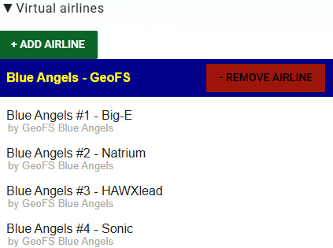
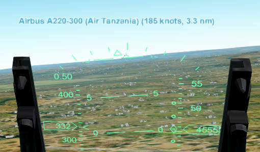

Github page for the GeoFS Blue Angels.

# Blue Angels livery
This allows the GeoFS Blue Angels team to use their Blue Angels livery, and see it in multiplayer, using the Livery Selector.
In the Livery Selector, add this Virtual Airline URL: https://raw.githubusercontent.com/ArjanKw/GeoFS-BlueAngels/refs/heads/main/airline.json

Now you can select the Blue Angels livery of your choice:
 

# Scripts
These scripts are used by the GeoFS Blue Angels to improve their flying. Install the browser extension Tampermonkey to manage these scripts easily.

## Multiplayer info
With this script you see the speed, distance and aircraft type for each aircraft, so you can intercept them easily. Press the L key to see/hide labels.

Installation: [add this script](https://raw.githubusercontent.com/ArjanKw/GeoFS-BlueAngels/refs/heads/main/Scripts/multiplayer-info.js) to Tampermonkey, or execute it in Developer Console.